# System Profiler

## System Under Test
All of the following tests were performed on a Dell Poweredge Server with 2 sockets and 8 memory channels.  Between the two Xeons there are a total of 32 logical cores available for the tests.  As far secondary memory goes, there are a total of 8 SAS 7.2K drives in a RAID 10 configuration.  It is also important to note that the RAID controller is  enterprise-class with a large on-board cache vastly increasing the performance.

## FIO Tests for Secondary Memory SAS Drives
### Bandwidth vs. Latency for Different R/W Configurations

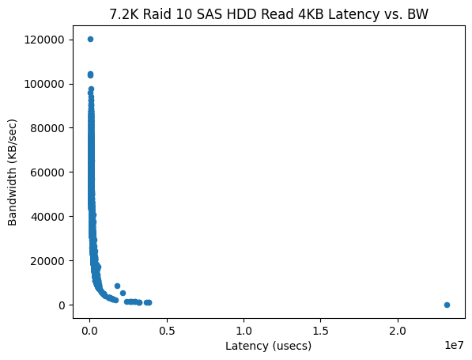
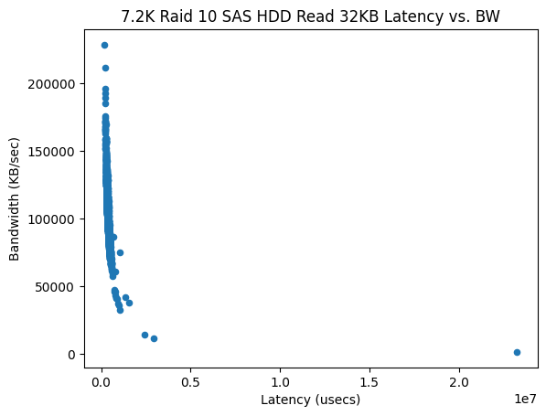
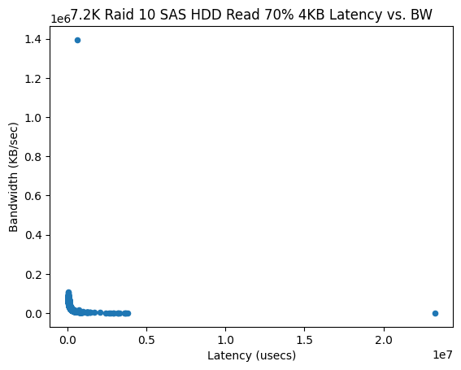
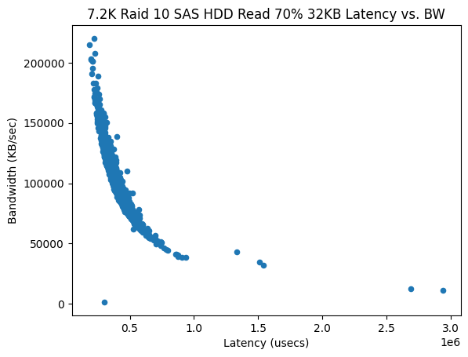
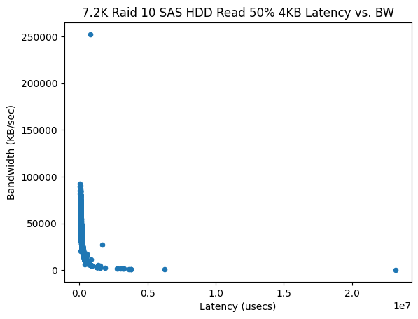
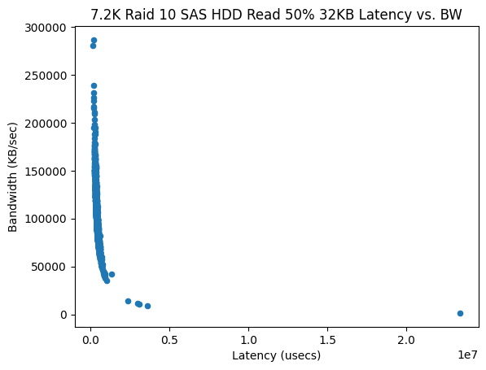
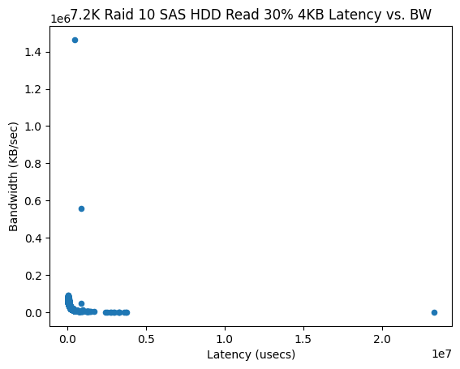
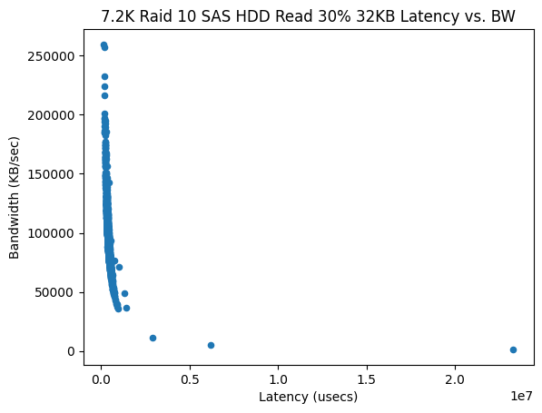

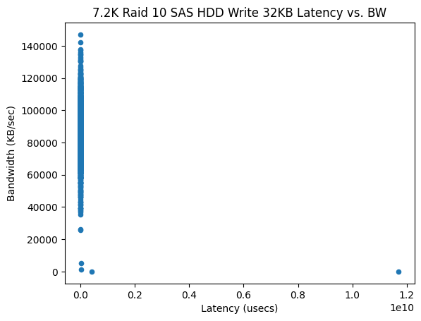

### R/W Configurations vs. Bandwidth
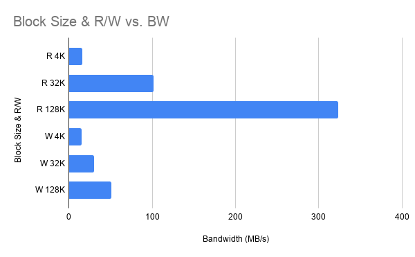

As we would expect, on average read speeds are much higher than write speeds for a HDD.  I suspect that the cache on the RAID card makes the write results a little deceiving for the smaller writes given that writing to the cache will be much faster than writing to the disk itself.  I'm also surprised that the bandwidth isn't higher given that the drives are RAIDed and are connected over SAS.  The tests were run on a VM here so its possible that might have had some impact on the bandwidth, but I don't think it would be that large of a difference.

### Bandwidth vs. IO Depth
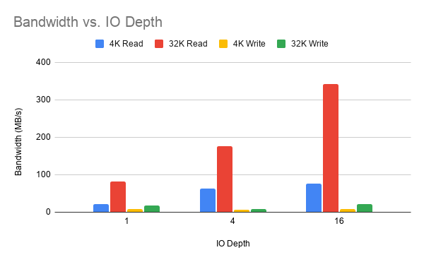

IO Depth is essentially the number of IO requests are being made to the IO device at a given time.  So a 4KB read IO depth of 1 means that the OS requests 1 4KB block from the IO device and waits until the data is ready before sending the next IO request.  Again like the other tests, in general bandwidth is increased (especially for reads) for bigger "batches."

### IOPS
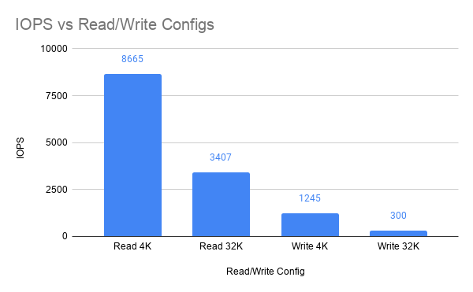

Again as expected for a hard drive, the read IOPs were much higher than the write IOPs.  The IOPs also dropped for higher block sizes but this is by definition as an operation with a larger block size will take longer but usally will result in a higher bandwidth.  This is far fewer IOPs than an SSD, especially an enterprise SSD due to the fact that the HDD has phsycially moving components.

## Intel Tests for Main Memory
### Memory Bandwidth for Different R/W Configurations
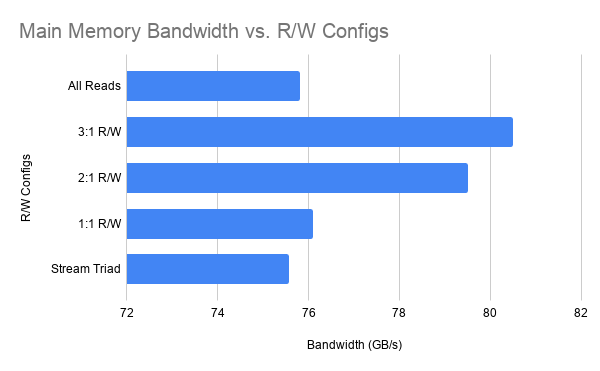

As can be seen in the plot, there isn't a massive difference between different read vs. write configurations and overall bandwidth.  This is expected because main memory is random access and has fixed timing.  I was a little surprised to see that all reads were among the slowest tested.  Please also note that the bandwidth on a server is substantially larger than desktop/laptop systems due to having many more memory channels.  

### Local vs. Remote Bandwidth
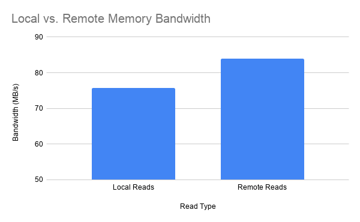

Each socket on a server will have a number of "local" channels, and will sometimes need to read/write to a "remote" channel that belongs to another socket.  NUMA standxs for non-uniform memory access and typically is going to be slower than accessing data local to the socket.  Remote accesses are speed up by having more logical cores, so I suspect that this is the reason why reading from a non-local channel had more bandwidth (but should have more latency).

## Overall Results
Its always a good idea to have a general idea about the hardware your using.  Given that I ran all my testson my server, the results as expected showed a vastly increased memory bandwidth despite using older DDR3 technology in addition to ECC.  The HDD speeds were disappointing given that they are RAIDed I would have expected better performance.  When compared with an enterprise SSD, obviously my hard drives were significantly slower in all aspects this can clearly be seen by the IOPs comparison.  The HDDs performed a better than consumer-grade HDDs with a larger IO Depth which I assume is because we will see more benefit with the RAID controller.
