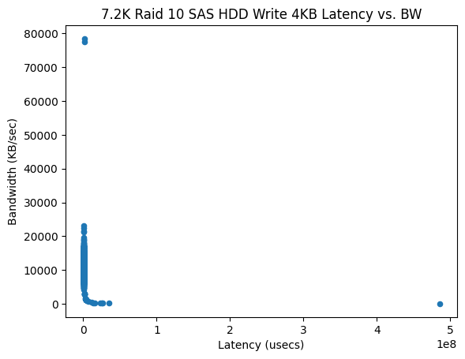

# System Profiler

## System Under Test
All of the following tests were performed on a Dell Poweredge Server with 2 sockets and 8 memory channels.  Between the two Xeons there are a total of 32 logical cores available for the tests.  As far secondary memory goes, there are a total of 8 SAS 7.2K drives in a RAID 10 configuration.  It is also important to note that the RAID controller is  enterprise-class with a large on-board cache vastly increasing the performance.

## FIO Tests for Secondary Memory SAS Drives
### Bandwidth vs. Latency for Different R/W Configurations

### R/W Configurations vs. Bandwidth

## Intel Tests for Main Memory
### Memory Bandwidth for Different R/W Configurations

As can be seen in the plot, there isn't a massive difference between different read vs. write configurations and overall bandwidth.  This is expected because main memory is random access and has fixed timing.  I was a little surprised to see that all reads were among the slowest tested.  Please also note that the bandwidth on a server is substantially larger than desktop/laptop systems due to having many more memory channels.  

### Local vs. Remote Bandwidth

Each socket on a server will have a number of "local" channels, and will sometimes need to read/write to a "remote" channel that belongs to another socket.  NUMA standxs for non-uniform memory access and typically is going to be slower than accessing data local to the socket.  Remote accesses are speed up by having more logical cores, so I suspect that this is the reason why reading from a non-local channel had more bandwidth (but should have more latency).
